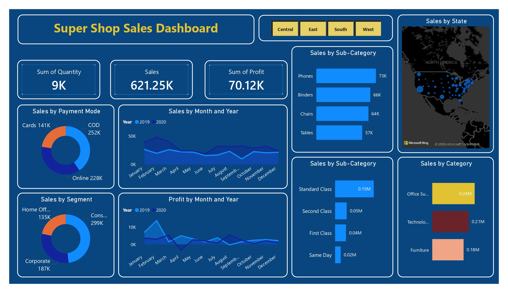

## 📊 Super Shop Sales Dashboard

This project presents an interactive **Sales Analytics Dashboard** built to analyze and visualize key business performance metrics of a super shop.

### 🔍 Overview
The dashboard provides a comprehensive view of sales performance, profit trends, and customer behavior across different dimensions such as region, category, segment, and payment mode.

### ⚙️ Tools & Techniques Used
- Data visualization using interactive charts and graphs  
- KPI cards for quick insights (Sales, Profit, Quantity)  
- Regional and categorical filtering for dynamic analysis  
- Time-series analysis for monthly and yearly trends  
- Map visualization for state-wise sales distribution  

### 📈 Key Features
- Sales, Profit, and Quantity summary at a glance  
- Category & Sub-category performance breakdown  
- Payment mode and customer segment analysis  
- Monthly sales and profit trend comparison (2019–2020)  
- Interactive regional filtering (Central, East, South, West)  
- Geographical sales distribution using map visualization  

### 🎯 Outcome
This dashboard helps in identifying sales trends, top-performing product categories, and regional performance insights, enabling data-driven business decisions.

